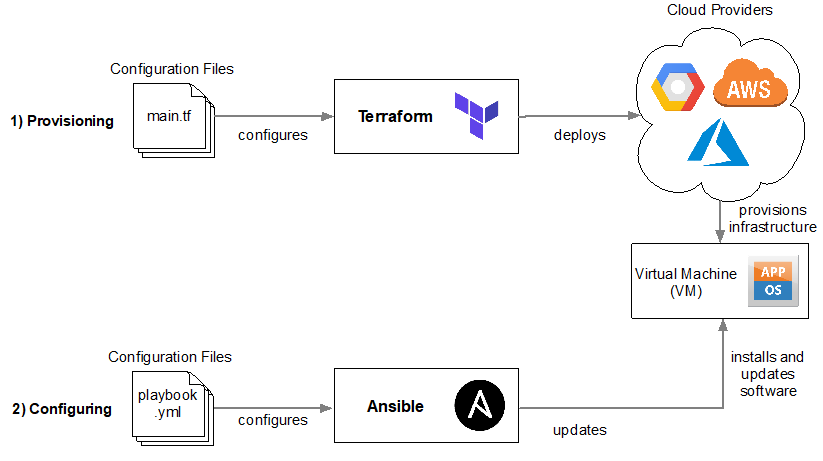

# infrastructure as code with terraform

### What is infrastructure as code?
Infrastructure as Code (IaC) is the process of managing and provisioning data centers through machine-readable definition files, rather than manual point-and-click. It means writing code to define your infrastructure, in the same manner you would write code to define your application software. Expressing your infrastructure as code has many distinct advantages over manual provisioning, such as being able to check code into version control systems, perform regular audit checks, and deploy faster and more reliably.

### What is terraform?
terraform creates the infrastructure, including the machine, networking, security and monitoring the machine


### Terraform commands

```
 terraform init

 terraform plan - checks the steps inside the .tf file and lists success or errors

 terraform apply - will implement the .tf file we have created - deploy the infrastructure
```

### DevOps and infrastructure as code
The idea behind infrastructure as code is that you WRITE and EXECUTE code to define, deploy, update and destroy your infrastructure.
Essentially you are treating all aspects of operations as software even thoughs aspects that represent hardware(such as setting up physical servers)
When implementing DevOps it should be possible to manage almost everyhting in code including: servers, databases, networks, log files, application configuration, documentation, automated tests, deployment processes...

### Types of Iac
- Ad hoc scripts
- Configuration management tools
- Server templating tools
- Orchestration tools
- Provisioning tools

### Orchestration Management tools
- Orchestration Management tools are essential when dealing with VMs within a cloud capacity
#### 1. Easily Deploy VMs
#### 2. Roll out updates to an existing fleet of VMs... rolling deployment
#### 3. Monitoring health of your VMs and automatically replace unhealthy ones
#### 4. Scale the number of VMs and containers up or down in response to load balancing (auto scaling)
#### 5. Allow your VMs to talk to one another over the network

### Terraform
Terraform is high-level language and is an open-source tool that is leveraged by DevOps engineers to deploy infrastructure from the comfort of their laptop.


### Ansible Vs Terraform


